# Use `repo2docker` to jump-start reproducibility

[`repo2docker`](https://repo2docker.readthedocs.io/en/latest/) is a utility maintained by Project Jupyter that creates stable Docker images based on [standard configuration files](https://repo2docker.readthedocs.io/en/latest/configuration/#config-files). It is suitable for Python, R, Python and R together, and Julia environments, and can also install Linux packages if needed.

In this tutorial, you will:
  1. Use `cookiecutter` to set up a repository that is ready to use for your DIWA VRE-compatible reproducible workflow
  2. Use the [`repo2docker` GitHub Action](https://github.com/jupyterhub/repo2docker-action/blob/master/README.md) to build a reproducible image
  3. Upload the image to DockerHub, and
  4. Start up a container with your environment on the DIWA VRE

The following diagram shows the different tools you will be using and how they relate to each other.

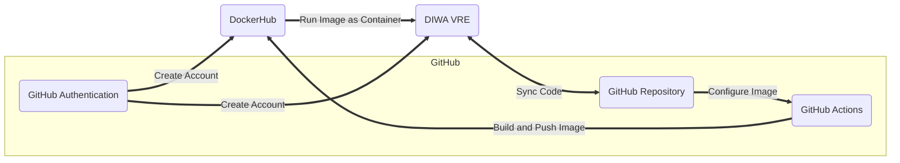

## Set up your accounts

### Before you start, make sure you have a GitHub Account

You will need a [GitHub account](https://github.com/signup?source=login) linked to the DIWA VRE to complete this tutorial. If you don't, **start at [this tutorial](https://github.com/DigitalWaters-fi/community/blob/main/how-tos/connect-vre-github/connect-vre-github.md)**

### Get started with DockerHub

You can then use that GitHub Account to create a **[DockerHub account](https://app.docker.com/signup)**.

#### Go to [DockerHub](https://app.docker.com/signup) and select `Continue with Github`

 and select `Continue with Github`](img/00-dockerhub.png)

#### Authorize

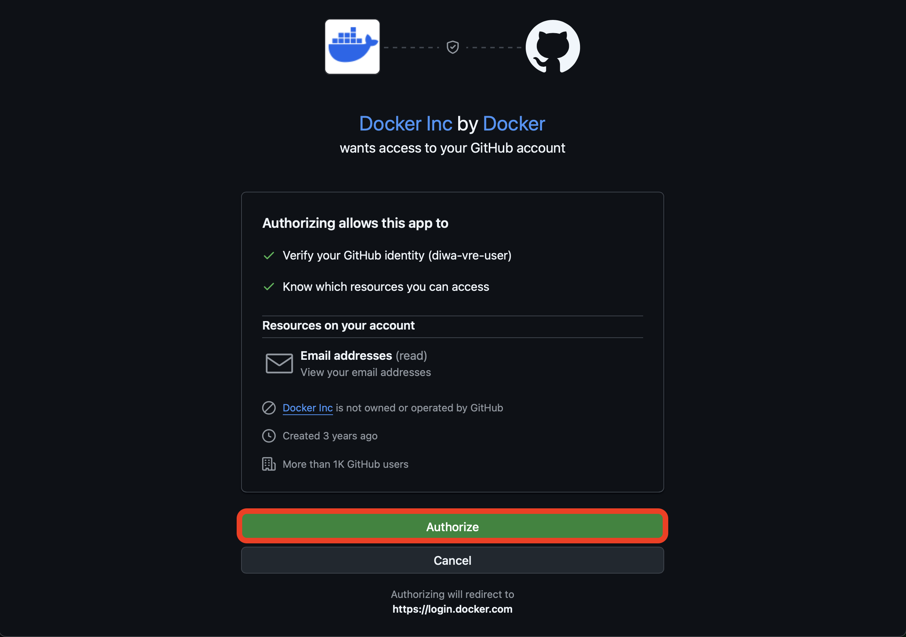

#### Follow instruction to verify your email

You should receive an email with instructions on verifying your account. Once you finish, you can navigate to the [DockerHub homepage](https://hub.docker.com) if you are not there already.

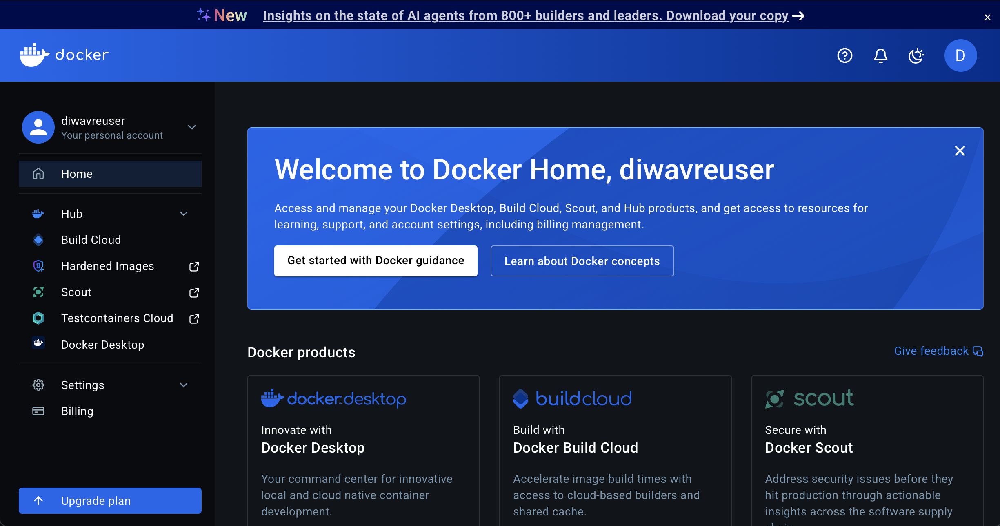

### Give GitHub Actions access to push to DockerHub

Images are a launchable record of all the setup steps needed for code to run. This is an important part of reproducibility, because it is difficult for someone else to create a computing environment that exactly meets the needs of your workflow. DockerHub lets you share images just like GitHub lets you share code, and GitHub Actions is useful for building images. All you need is to be able to upload your image once it is complete!

#### Create a Personal access token on DockerHub

##### Go to DockerHub account settings

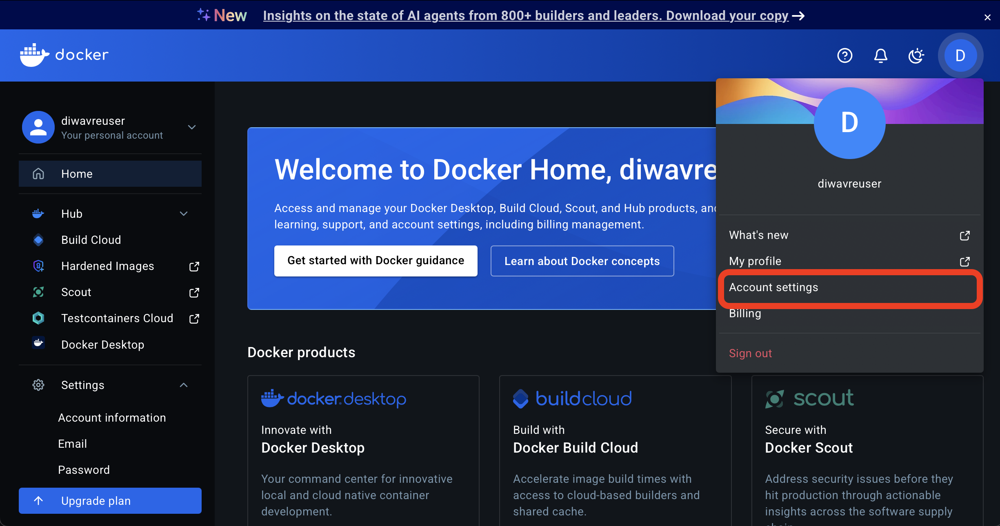

##### Select `Personal access tokens`

You may need to scroll down in the menu on the left.


##### Select `Generate new token`

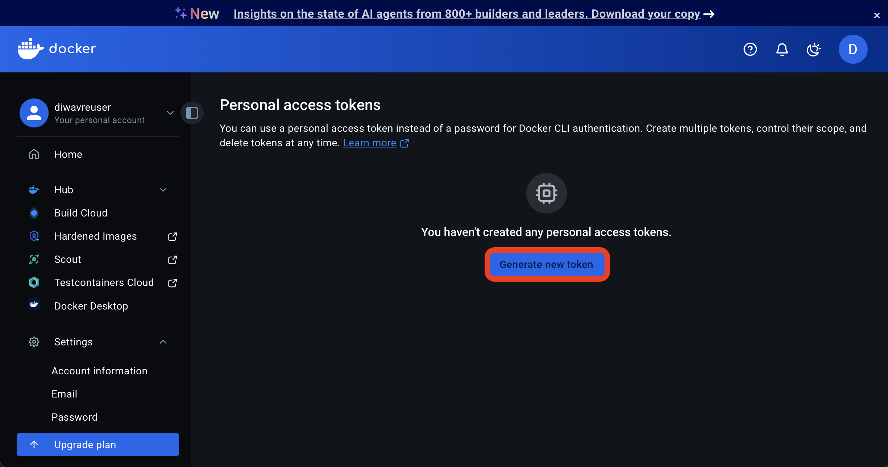

##### Add a description, click `Generate token`, select Read and Write permissions, and copy it

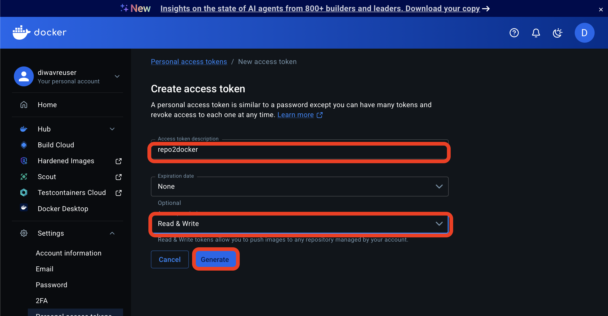

Make sure to copy!

#### Add the PAT to GitHub

##### Return to your GitHub repository

Next, navigate to the repository you are working on in GitHub. You can create a DIWA VRE and `repo2docker`-compatible repository using our cookiecutter.

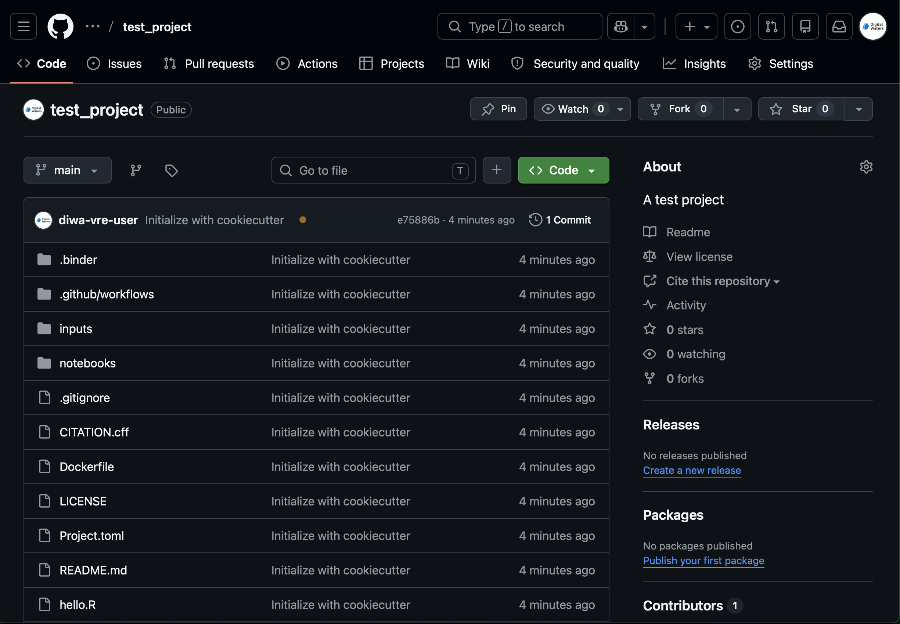

##### Navigate to Settings

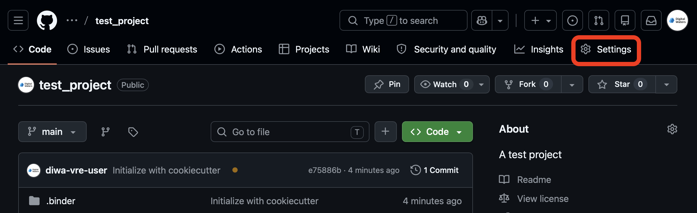

##### Select Actions Secrets

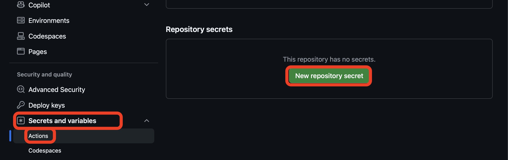

##### Add your DockerHub credentials as repository secrets

The secrets must be named EXACTLY `DOCKER_USERNAME` and `DOCKER_PASSWORD`. However, the *values* of the secrets should *not* match what you see here -- they should be *your* docker username and PAT.

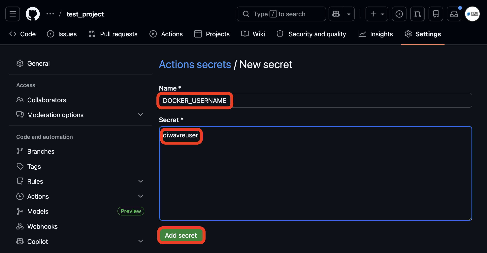

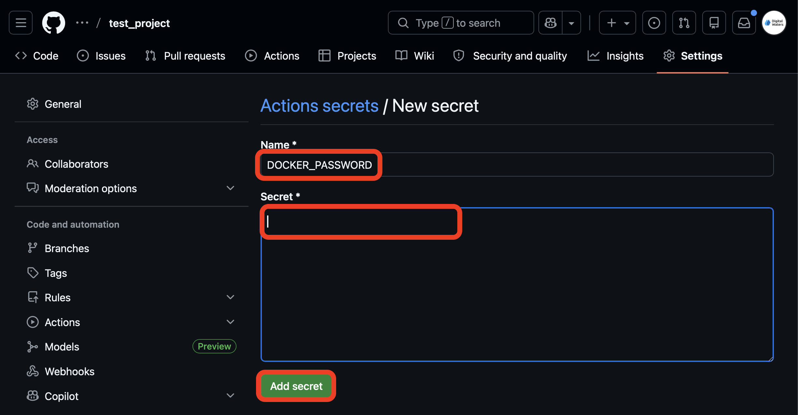

Once you have added the secrets make sure you check that the names are correct! Otherwise GitHub Actions will not be able to find the values you saved.

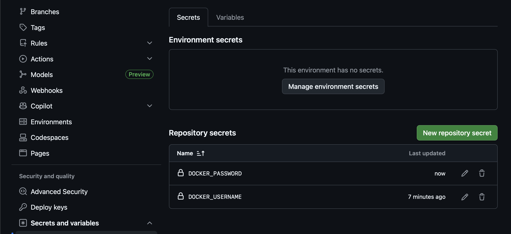

## Build your environment

### Start out with our cookiecutter

We have prepared a template repository, and you can fill in your details using the cookiecutter utility. 

#### Open a cookiecutter image on the DIWA VRE

Start by logging into the [DIWA VRE](https://diwa-data-lab-vre.rahtiapp.fi/). From the home page, select `Custom Image`, paste `eculler/diwa_repo_cookiecutter` into the image field, and click `Launch`


#### Run the cookiecutter command in the Terminal

Open a Terminal tab, and run the following command, and respond to the prompts with information about *your* project:

```bash
cookiecutter https://github.com/LizCarter492/DIWA_repo_cookiecutter
```

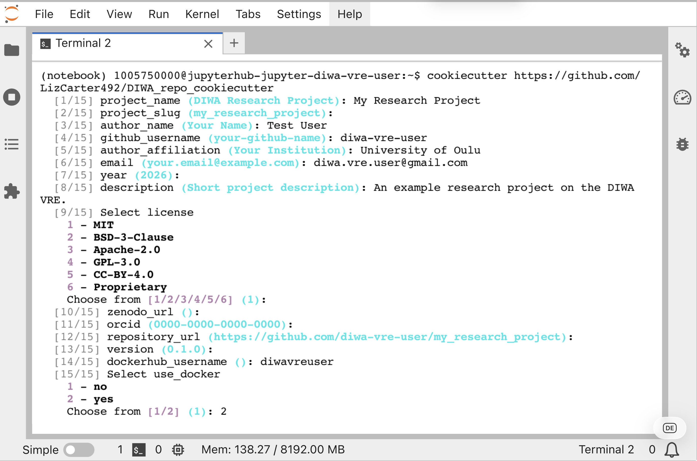

You should now see a folder titled with your chosen project slug in your home directory:

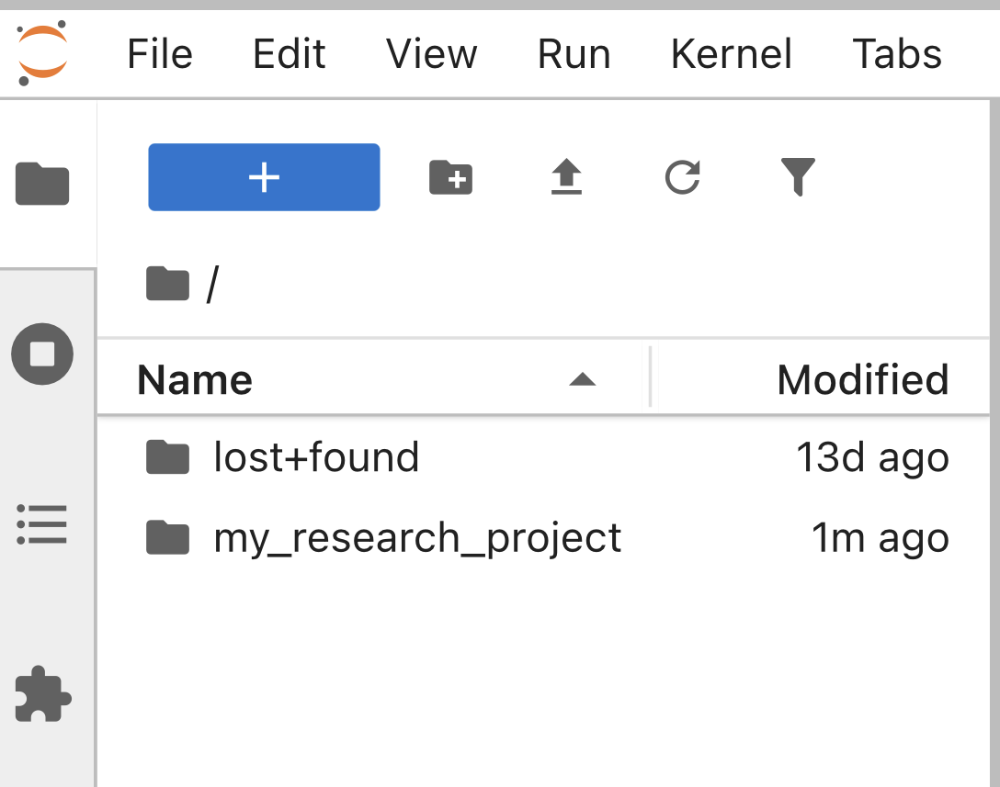

The project directory should also contain the DIWA cookiecutter template files:

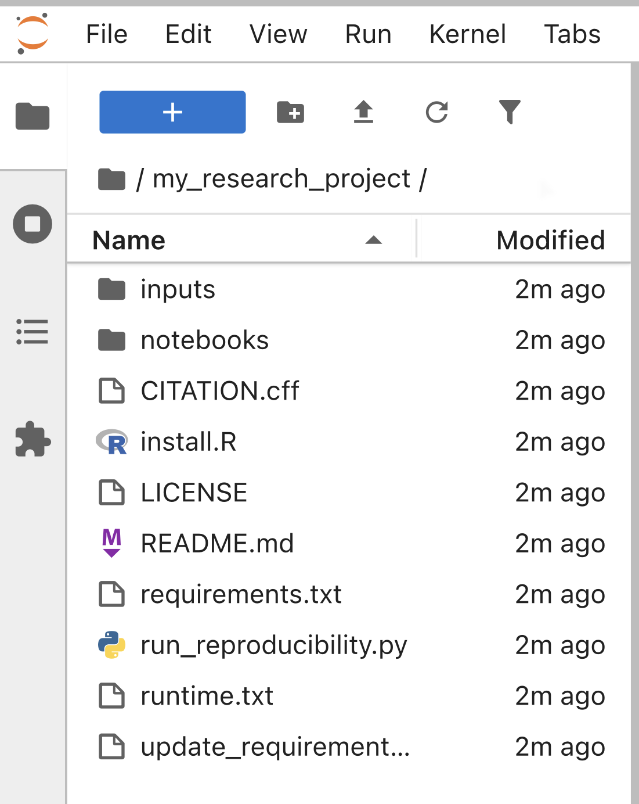

### Sync your project with GitHub

[Follow these instructions from GitHub](https://docs.github.com/en/migrations/importing-source-code/using-the-command-line-to-import-source-code/adding-locally-hosted-code-to-github) to create a new GitHub repository out of your project directory.

**Make sure that when you are linking your repository on the VRE to the remote origin on GitHub that you select SSH authentication!!!**

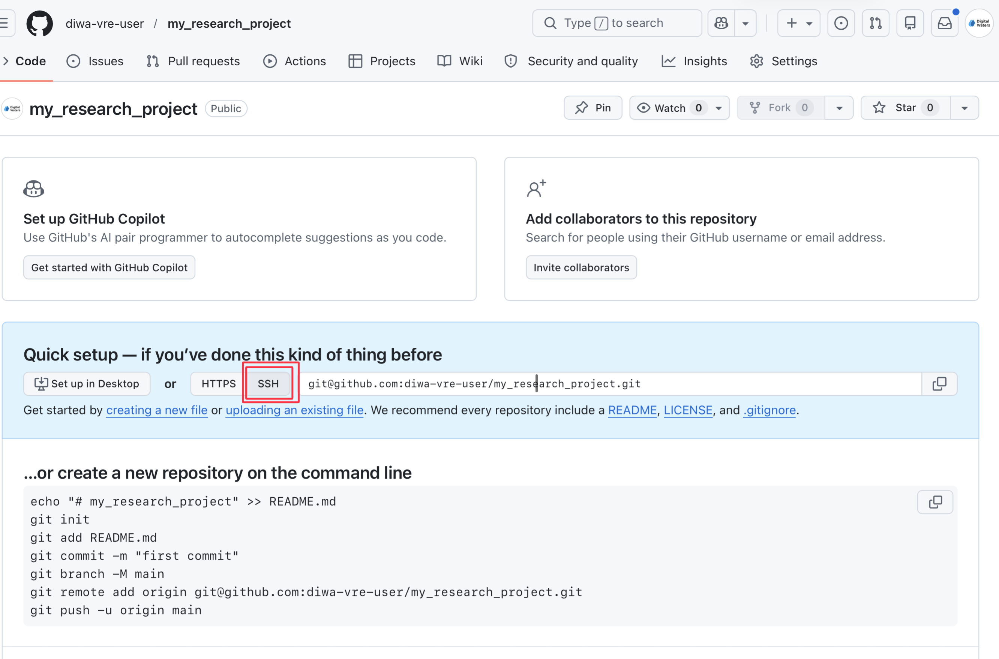

You should now be able to see your project on GitHub:

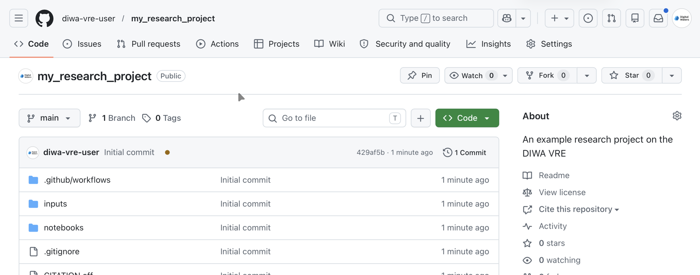

### Configure your environment

The next step is to make sure that you have put all your **configuration files** into your repository.  That means environment.yml (conda) or requirements.txt (pip) for Python libraries, and install.R for R libraries. If you want to use R and Python together, you will also need a `runtime.txt` file with the version and date of R that you want to use. You can check out the [`repo2docker` documentation](https://repo2docker.readthedocs.io/en/latest/start/) for more information on other types of configurations.

When you use cookiecutter, you should have examples of common configuration files already in your repository. However, you will need to customize them with the particular packages or libraries that you are using. Extra configuration files or packages will cause the build to take longer, so make sure you remove anything you don't need!

### Go to the Actions tab on GitHub

> You may need to enable Actions depending on how you created your repository.

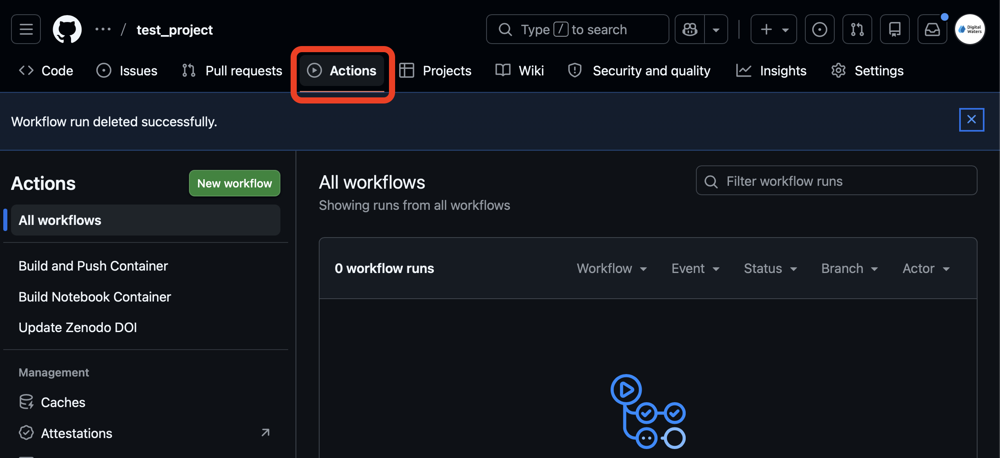

### Select the Build and Push Container workflow and run it.

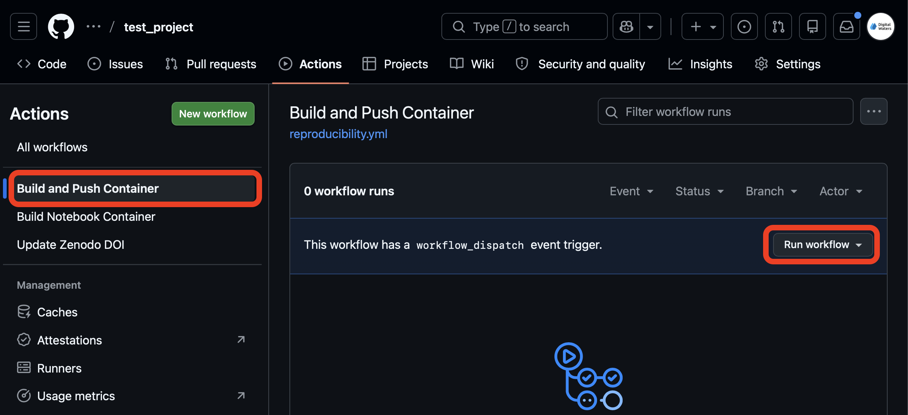

## Try your environment on the VRE

