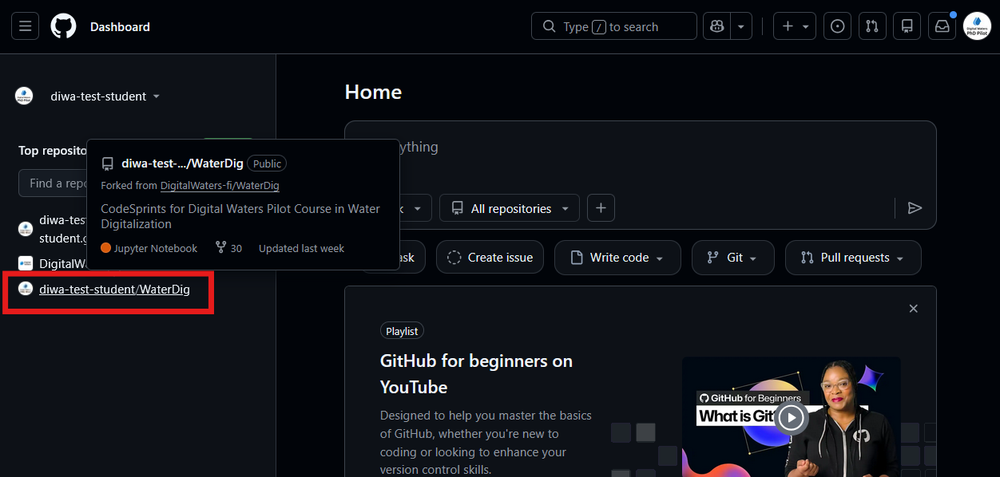
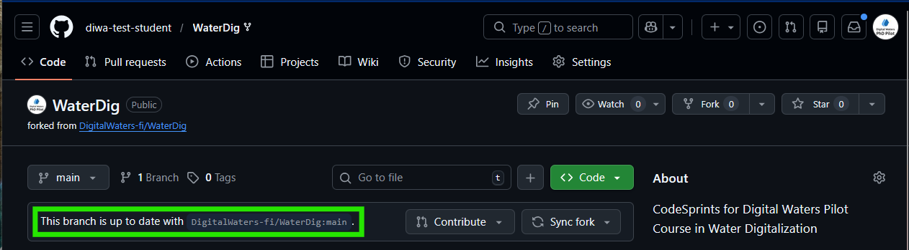

First, you will need to sync your forked repository with the original repository. This is also called **pulling upstream**, because you are moving changes made in the original (upstream) repository into your repository (pulling).



> On GitHub.com, navigate to YOUR forked repository. Make sure it is the repository in your GitHub account, not the original repository that you forked!


> Click on `Sync fork`, and then `Update branch`



> Your repository should now say that you are up to date with the original repository.

## Update your local copy

Next, you will need to pull the changes made on GitHub to your local copy. Open up a terminal and navigate to you local repository directory:

```bash
cd WaterDig
```

If you are on the DIWA VRE and opened a fresh server, you will need to decrease the permissions of your SSH private key to connect securely with GitHub

```bash
chmod 600 /home/jovyan/.ssh/id_ed25519
```

Next, make sure that all your local changes are committed before you try to pull anything from GitHub:

```bash
git status
git add .
git commit -m "saving anything unsaved since last class"
```

Pull the updates from GitHub:

```bash
git pull
```

Note that if you have not configured the default merge strategy you may need to either configure that, e.g.:

```bash
git config --global pull.rebase false
```

OR, you could specify the merge strategy in the command, e.g.:

```bash
git pull --rebase
```

When you pull changes, it is possible they will conflict with your local changes. Read the output from the `git pull` command carefully, and if it says there are merge conflicts make sure to resolve those. 

After resolving any merge conflicts, you should be able to push your committed changes along with the upstream updates back to GitHub:

```bash
git status
git add . 
git commit -m "merging upstream changes"
git push
```
